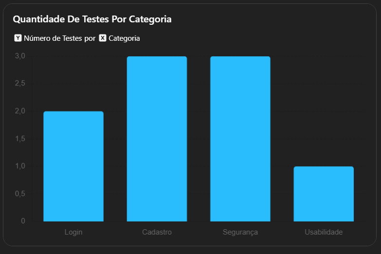
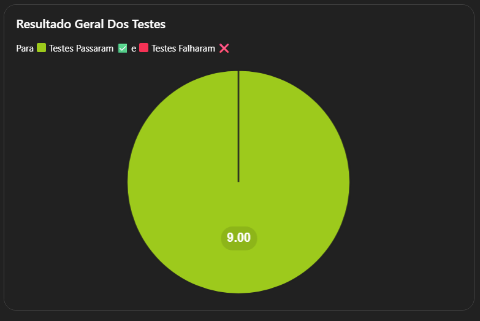

# 📃 Relatório de Testes - Trabalho 2º Bimestre - PQS

## 📚 Índice

- [1. Introdução](#1-introdução-)
- [2. Justificativas](#2--justificativas)
- [3. Testes Realizados](#3-testes-realizados-)
  - [3.1 Testes Funcionais](#31-testes-funcionais-)
  - [3.2 Testes Não Funcionais](#32-testes-não-funcionais-)
- [4. Execução dos Testes](#4--execução-dos-testes)
- [5. Resultados Obtidos](#5-resultados-obtidos-)
- [6. Considerações Finais](#6-considerações-finais-)
- [7. Demonstração em Vídeo](#7--demonstração-em-vídeo)
- [8. Integrantes do Grupo](#8-integrantes-do-grupo-)

---

## 1. Introdução 📘

Este relatório apresenta a execução de testes de **caixa preta**, com foco em testes **funcionais** e **não funcionais**, realizados de forma automatizada no sistema **OrangeHRM**, uma plataforma web de gestão de recursos humanos.

---

## 2. 📕 Justificativas

### Sistema Escolhido 🌐

O sistema utilizado foi o **OrangeHRM (versão demo online)**

[](https://opensource-demo.orangehrmlive.com/web/index.php/auth/login)

**Motivos da escolha:**
- Sistema web público e gratuito;
- Simula rotinas reais de um RH corporativo;
- Possui funcionalidades de login, cadastro, consulta e exclusão.

### 🛠️ Ferramentas Utilizadas

- **Python**: linguagem de programação para automação;
- **Pytest**: estrutura de execução dos testes;
- **Selenium WebDriver**: automação da interação com elementos da interface;
- **WebDriverWait / expected_conditions**: aguardam elementos de forma sincronizada;

---

## 3. Testes Realizados ⚗

### 3.1 Testes Funcionais 🧪

#### a) Autenticação  
📄 Arquivo: `test_login.py`

- `def test_login_valido`: Teste com login válido  
- `def test_login_invalido`: Teste com login inválido

#### b) Entrada de Dados  
📄 Arquivo: `test_entrada_dados.py`

- `def test_registro_valido`: Cadastro com dados válidos  
- `def test_registro_invalido_sem_sobrenome`: Cadastro com sobrenome ausente  
- `def test_registro_invalido_matricula_repetida`: Cadastro com matrícula duplicada

---

### 3.2 Testes Não Funcionais 🔐

#### a) Segurança  
📄 Arquivo: `test_seguranca.py`

- `def test_verifica_campo_senha`: Verifica se o campo de senha oculta os caracteres  
- `def test_redireciona_para_login_se_nao_logado`: Garante redirecionamento para login se não autenticado  
- `def test_logout`: Testa se o logout bloqueia acesso posterior

#### b) Usabilidade  
📄 Arquivo: `test_usabilidade.py`

- `def test_usabilidade_deletar_funcionario`:  
  - Permite buscar e excluir um funcionário  
  - Verifica mensagens de confirmação visual  
  - Testa confirmação e cancelamento da exclusão

---

## 4. 🚀 Execução dos Testes

Os testes foram executados com `pytest`, utilizando o Selenium WebDriver para controlar um navegador real.  
- Fixtures organizadas em `conftest.py`;
- Funções comuns encapsuladas em `funcoes.py`.

Para executar:
```bash
pip install -r requirements.txt  
pytest
```
---

## 5. Resultados Obtidos 📈

| Tipo de Teste             | Nome do Teste                         | Resultado Esperado               | Status |
|---------------------------|---------------------------------------|----------------------------------|--------|
| Funcional - Login         | Login com dados válidos               | Dashboard carregado              | ✔️     |
| Funcional - Login         | Login com dados inválidos             | Alerta de erro visível           | ✔️     |
| Funcional - Cadastro      | Cadastro com dados válidos            | Página de detalhes               | ✔️     |
| Funcional - Cadastro      | Sem sobrenome                         | Erro de campo obrigatório        | ✔️     |
| Funcional - Cadastro      | Matrícula repetida                    | Erro de matrícula duplicada      | ✔️     |
| Não Funcional - Segurança | Senha oculta                          | Campo com `type="password"`      | ✔️     |
| Não Funcional - Segurança | Página interna sem login              | Redirecionamento para login      | ✔️     |
| Não Funcional - Segurança | Logout bloqueia acesso posterior      | Redirecionamento para login      | ✔️     |
| Não Funcional - Usabilidade | Excluir funcionário                 | Confirmação + exclusão visível   | ✔️     |

<h2>📊 Gráficos dos Testes</h2>

<p align="center">
  
  &nbsp;&nbsp;&nbsp;&nbsp;
  
</p>

---

## 6. Considerações Finais 🏁

Todos os testes foram executados com sucesso, validando o comportamento do sistema tanto em funcionalidades essenciais quanto em aspectos de segurança e usabilidade.

A abordagem automatizada trouxe **agilidade**, **precisão** e **confiabilidade** na verificação do sistema.

---

## 7. 🎥 Demonstração em Vídeo

Para uma visualização prática do sistema em funcionamento, assista ao vídeo de demonstração abaixo:

[](https://www.youtube.com/watch?v=xcJtL7QggTI)

---

## 8. Integrantes do Grupo 👨‍💻

- Nome do Aluno 1 (RA: XXXXXXX)
- Nome do Aluno 2 (RA: XXXXXXX)
- Nome do Aluno 3 (RA: XXXXXXX)
- Nome do Aluno 4 (RA: XXXXXXX)

📘 **Instituição:** Universidade Dom Bosco  
📚 **Disciplina:** Prática de Qualidade de Software – 2º Bimestre  
👨‍🏫 **Professor:** Valdinei Saugo
